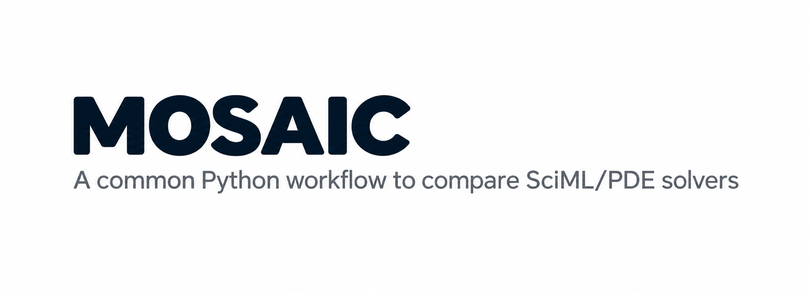

  <picture>
    <source media="(prefers-color-scheme: dark)" srcset="assets/banner-dark.png">
    
  </picture>

MOSAIC is a common Python workflow for comparing SciML/PDE solvers.
The workspace combines:

- single-interface solver execution -- different numerical, JAX-based, and HPC solvers can be plugged
- common solver interfaces -- run different PDE solvers without rewriting the surrounding analysis pipeline
- standardized metrics -- compare accuracy, convergence, stability, runtime, and scaling consistently
- automated result generation -- produce plots, tables, and reports from the same benchmark configuration
- reproducible comparisons -- keep solver configurations, metrics, and benchmark results consistent
- scalable workflows -- evaluate solver performance across CPUs, GPUs, and HPC systems
- extensible architecture -- add your own solver and plug it directly into the comparison pipeline
